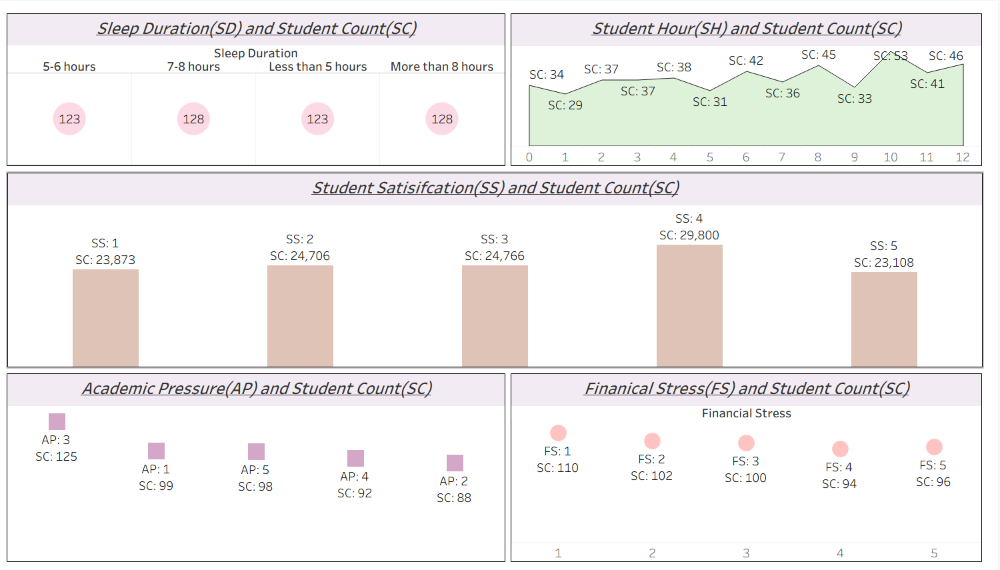

# 📊 Student Depression Analysis Dashboard — Tableau + SQL


> **Tool:** Tableau  
> **Supporting Tool:** SQL  
> **Domain:** Student Mental Health / Student Well-being Analytics  
> **Project Type:** Dashboard + SQL Data Preparation  
> **Focus:** Sleep duration, study hours, student satisfaction, academic pressure, financial stress, and depression-related student behavior analysis

---

## 📌 About This Project

The **Student Depression Analysis Dashboard** is a data analytics project built to explore patterns in **student lifestyle, academic stress, financial stress, satisfaction levels, and depression-related factors** using a student mental health dataset.

The dashboard helps analyze how variables such as **sleep duration, study hours, academic pressure, financial stress, and student satisfaction** are distributed across students. The goal of this project is to transform raw student data into a visual dashboard that can help identify patterns related to **student well-being, academic stress, and possible mental health risk factors**.

This project combines:

- **SQL** for data cleaning, standardization, transformation, and feature creation
- **Tableau** for building the dashboard and presenting insights visually

---

## 🎯 Project Objective

The main objective of this project is to analyze student-related behavioral and academic factors that may influence mental health conditions such as stress and depression.

This dashboard is designed to answer questions like:

- How are students distributed across different **sleep duration categories**?
- How does **study hour distribution** vary among students?
- What is the distribution of **academic pressure** and **financial stress** levels?
- Which **student satisfaction levels** have the highest number of students?
- How can SQL-transformed fields and grouped analysis support better understanding of student stress and depression patterns?

---

## 📂 Repository Structure

```bash
Student_Depression_Analysis_Dashboard/
│
├── Depression+Student+Dataset.csv
├── Student_Depression_Analysis_Dashboard.png
├── Sql_query.sql
└── README.md
```

### 🔗 Quick Navigation
- 📊 [Dashboard Image](./Student_Depression_Analysis_Dashboard.png)
- 📂 [Dataset CSV](./Depression+Student+Dataset.csv)
- 🗄️ [SQL Query File](./Sql_query.sql)

---

# 🖥️ Dashboard Overview



The dashboard presents a compact analytical view of student-related variables and compares them against **student count (SC)** to identify how different stress, lifestyle, and satisfaction factors are distributed.

The dashboard includes analysis of:

- **Sleep Duration (SD) and Student Count (SC)**
- **Student Hour (SH) and Student Count (SC)**
- **Student Satisfaction (SS) and Student Count (SC)**
- **Academic Pressure (AP) and Student Count (SC)**
- **Financial Stress (FS) and Student Count (SC)**

---

# 📊 Dashboard Sections Explained

## 1️⃣ Sleep Duration (SD) and Student Count (SC)

This section shows how students are distributed across different sleep duration categories such as:

- **5–6 hours**
- **7–8 hours**
- **Less than 5 hours**
- **More than 8 hours**

### Purpose
This helps identify whether students are concentrated in lower sleep duration ranges, which can be an important factor when studying stress, fatigue, and depression-related behavior.

---

## 2️⃣ Student Hour (SH) and Student Count (SC)

This section visualizes how many students fall into different **study hour groups**.

### Purpose
Study hours are a key behavioral variable in student analytics because extremely high or low study hours may be associated with academic pressure, burnout, performance stress, or time-management challenges.

---

## 3️⃣ Student Satisfaction (SS) and Student Count (SC)

This section shows the distribution of students across different **student satisfaction levels**.

### Purpose
Student satisfaction can act as a useful indicator of academic well-being and overall educational experience. Lower satisfaction may correlate with stress, low motivation, or poor mental well-being.

---

## 4️⃣ Academic Pressure (AP) and Student Count (SC)

This section displays how students are distributed across different levels of **academic pressure**.

### Purpose
Academic pressure is one of the most important variables in this project because it directly reflects how much educational burden students may be experiencing.

This helps identify:
- whether most students fall under moderate or high pressure levels
- whether academic pressure is concentrated in specific categories
- whether pressure may be considered a possible mental health risk factor

---

## 5️⃣ Financial Stress (FS) and Student Count (SC)

This section analyzes the distribution of students by **financial stress levels**.

### Purpose
Financial stress is another important non-academic factor that can strongly affect student mental health, concentration, and overall well-being.

This visual helps compare how many students fall into each financial stress category and whether financial pressure is widespread among students.

---

# 📂 Dataset Used

This project uses the following dataset available in this repository:

- 📄 [Depression+Student+Dataset.csv](./Depression+Student+Dataset.csv)

The dataset contains student-related information such as lifestyle, academic pressure, satisfaction, study behavior, stress, and depression-related variables that are useful for student mental health analysis.

---

# 📊 Key Fields / Variables Used

The dashboard is built around the following key variables:

| Field | Meaning |
|------|---------|
| **Sleep_Duration** | Number / category of hours students sleep |
| **Study_Hours** | Hours spent studying |
| **Study_Satisfaction** | Student satisfaction / academic satisfaction level |
| **Academic_Pressure** | Level of academic pressure experienced by students |
| **Financial_Stress** | Level of financial stress experienced by students |
| **Student Count (SC)** | Count of students in each category |

---

# 🗄️ SQL Work Done in This Project

SQL was used as an important part of this project for **data cleaning, standardization, transformation, and preparation** before building the dashboard.

The full SQL file is available here:

- 🗄️ [Sql_query.sql](./Sql_query.sql)

## SQL Tasks Performed

### 1. Database setup and raw data inspection
The SQL workflow started with:
- creating the project database
- selecting the raw dataset table
- checking initial records before transformation

### 2. Gender standardization
The `Gender` field was cleaned and standardized using SQL:

- `Male` → `M`
- `Female` → `F`

This improves consistency and makes categorical analysis cleaner in Tableau.

### 3. Null / blank value checking
The dataset was checked for:
- `NULL` values in `Gender`
- blank values in `Gender`

This step helps identify data quality issues before visualization.

### 4. Age group feature creation
A new column called **`Age_Group`** was created using SQL.

```sql
CASE 
    WHEN Age BETWEEN 18 AND 24 THEN 'A1'
    WHEN Age BETWEEN 24 AND 30 THEN 'A2'
    ELSE 'A3'
END
```

This transformation groups students into broader age categories and makes age-based analysis simpler.

### 5. Grouped analysis of important variables
SQL was used to calculate category-wise counts for multiple variables before building the dashboard, including:

- `Academic_Pressure`
- `Study_Satisfaction`
- `Sleep_Duration`
- `Dietary_Habits`
- `Have_you_ever_had_suicidal_thoughts`
- `Study_Hours`
- `Financial_Stress`
- `Family_History_of_Mental_Illness`
- `Depression`

These queries helped in understanding the distribution of student responses and selecting variables for dashboard analysis.

### 6. Index column creation
An additional **`Index_Column`** was created using SQL with:

```sql
IDENTITY(1,1)
```

This gives each row a unique sequential identifier.

### 7. Depression field transformation
The `Depression` field was standardized from numeric values into readable categories:

- `0` → `No`
- `1` → `Yes`

This makes the field more understandable in both SQL analysis and Tableau dashboards.

### 8. Column datatype update
The `Depression` column datatype was altered to `varchar(max)` so the transformed values (`Yes` / `No`) could be stored properly.

---

# ⚙️ Technical Workflow

## Tools Used
- **SQL** → Data cleaning, transformation, feature engineering, grouped analysis
- **Tableau** → Dashboard design and visualization

## Workflow Followed
1. Loaded the student depression dataset into SQL
2. Inspected raw records and categorical fields
3. Standardized `Gender` values
4. Checked for null / blank values
5. Created derived features such as `Age_Group`
6. Performed grouped analysis on important variables
7. Converted depression flags into readable values (`Yes` / `No`)
8. Prepared dashboard-ready data
9. Built the final dashboard in Tableau to visualize student count across key stress and lifestyle factors

---

# 📈 Insights the Dashboard Helps Explore

This dashboard can help explore questions such as:

- Are a large number of students sleeping less than recommended hours?
- Are higher study-hour groups more common among students?
- Which student satisfaction levels have the highest student count?
- Is academic pressure heavily concentrated in certain categories?
- Is financial stress common across a large section of students?

These insights can support further analysis in areas such as:

- **student wellness**
- **mental health analytics**
- **academic stress analysis**
- **student lifestyle pattern analysis**

---

# 💡 Business / Analytical Value of This Project

Although this project is based on student mental health data, it demonstrates strong analytics skills in:

- **data cleaning with SQL**
- **categorical value standardization**
- **derived column creation**
- **grouped exploratory analysis**
- **dashboard design in Tableau**
- **visual storytelling with grouped variables**
- **turning raw survey-style data into readable insights**

This project can be useful for:
- academic institutions
- student wellness research
- education analytics projects
- mental health awareness analysis
- portfolio demonstration of SQL + Tableau skills

---

# 🚀 Conclusion

The **Student Depression Analysis Dashboard** is a strong example of combining **SQL-based data preparation** with **Tableau dashboard design** to analyze student well-being and stress-related indicators.

By studying variables such as **sleep duration, study hours, academic pressure, financial stress, and student satisfaction**, the dashboard helps present student lifestyle and stress patterns in a clear and visual way.

This project is especially useful as a **portfolio project** because it demonstrates:

- SQL transformation and cleaning skills
- feature engineering using SQL
- dashboard-building ability in Tableau
- categorical data analysis
- visual communication of student mental health analytics

---

## 📬 Connect With Me

[](https://linkedin.com/in/het-ladani-5001bb29a/)
[](https://github.com/ladanihet2410)